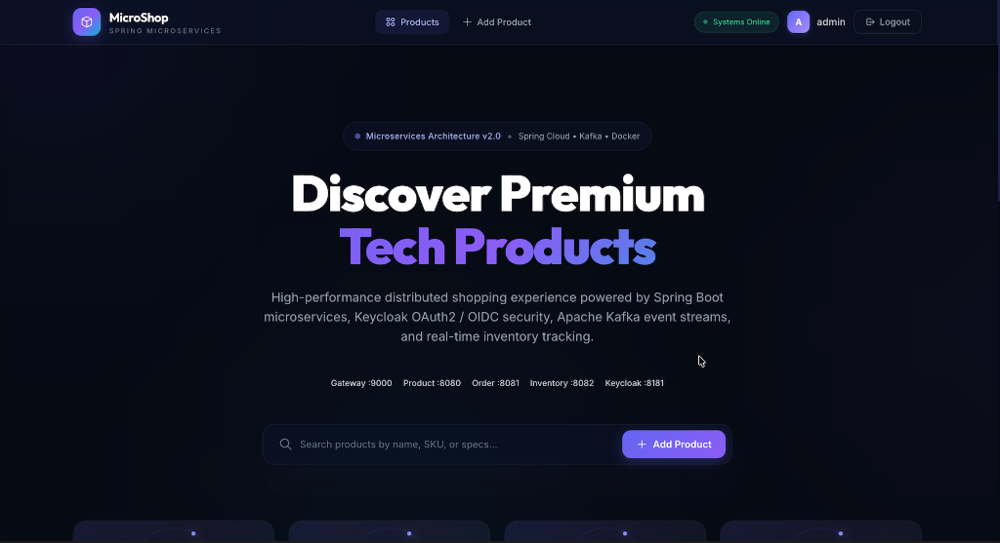
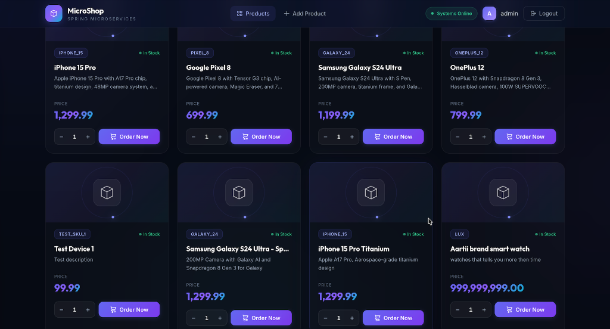
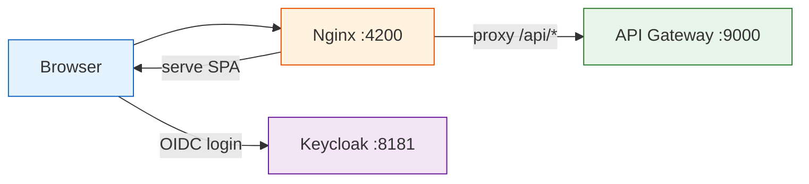

# Microservices Shop Frontend

The customer-facing Angular SPA for the e-commerce platform. It connects to the backend microservices through the API Gateway and uses Keycloak for authentication via OpenID Connect (PKCE flow).

Built with **Angular 18**, **TailwindCSS**, and custom CSS with a dark-themed glassmorphism design. In production it runs inside an **Nginx** container that serves the built assets and reverse-proxies API calls to the gateway.

## Features

- Browse the product catalog without signing in
- Sign in via Keycloak (OIDC with PKCE, no client secret)
- Add new products to the catalog (authenticated only)
- Order products with a quantity selector
- Real-time search across product name, description, and SKU
- Toast notifications for order success and error states
- Responsive layout that works on mobile and desktop

## Screenshots

### Home Page & Hero Section
The main hero section with glassmorphism navigation, animated gradient typography, and live microservices status:



### 3D Product Catalog & Inline Ordering
Interactive 3D product cards with real-time stock indicators, pricing, quantity selectors, and one-click ordering:



## How it connects



In Docker, the Angular app is compiled into static files and served by Nginx. The Nginx config routes all `/api/*` requests to the API Gateway over the internal Docker network, which means the frontend never makes cross-origin requests in production.

For local development (`ng serve`), the Angular dev server runs on port 4200 and API calls go directly to `localhost:9000`.

## Authentication

The app uses `angular-auth-oidc-client` to handle OIDC. The configuration points at the Keycloak realm:

- **Authority**: `http://localhost:8181/realms/Spring-microservices-security-realm`
- **Client ID**: `spring-cloud-client-public` (public client, no secret)
- **Scopes**: `openid profile email`
- **Flow**: Authorization Code with PKCE

The auth interceptor attaches the Bearer token to outgoing API calls using RxJS `switchMap` + `take(1)` to avoid race conditions with token refresh.

## Running locally

Prerequisites: Node.js 20+, npm, Keycloak running on port 8181.

```bash
npm install
ng serve
```

Open `http://localhost:4200`. The dev server proxies API calls based on your service configuration in `product.service.ts` and `order.service.ts`.

## Building for production

```bash
npm ci
ng build --configuration=production
```

Output goes to `dist/microservices-shop-frontend/`. The Dockerfile handles this automatically in a multi-stage build.

## Docker deployment

The Dockerfile is a two-stage build:

1. **Build stage**: `node:20-alpine` runs `npm ci` and `ng build`
2. **Serve stage**: `nginx:alpine` copies the built files and the custom `nginx.conf`

The Nginx config:
- Serves the SPA with `try_files` fallback for client-side routing
- Proxies `/api/*` to `http://api-gateway:9000`
- Enables gzip compression for JS, CSS, HTML
- Caches static assets with 1-year expiry

## Project structure

```
src/
├── app/
│   ├── config/
│   │   └── auth.config.ts           # OIDC configuration for Keycloak
│   ├── interceptor/
│   │   └── auth.interceptor.ts      # Attaches Bearer token to requests
│   ├── pages/
│   │   ├── home-page/               # Product catalog with ordering
│   │   └── add-product/             # Product creation form
│   ├── services/
│   │   ├── product/product.service.ts  # GET/POST /api/product
│   │   └── order/order.service.ts      # POST /api/order
│   └── shared/
│       └── header/                  # Navigation bar component
├── index.html                       # Google Fonts, meta tags, theme color
└── styles.css                       # Global dark theme + animations

screenshots/
├── home-page.png                    # Hero section & search screenshot
└── product-grid.png                 # 3D product cards & ordering grid screenshot

nginx.conf                          # Production Nginx configuration
Dockerfile                           # Multi-stage build (Node + Nginx)
tailwind.config.js                   # Extended dark color palette
```

## Tech stack

- Angular 18 (standalone components)
- TailwindCSS + custom CSS (glassmorphism, 3D transforms)
- angular-auth-oidc-client (OIDC/PKCE)
- RxJS
- Nginx Alpine (production serving)
- Google Fonts (Inter)
